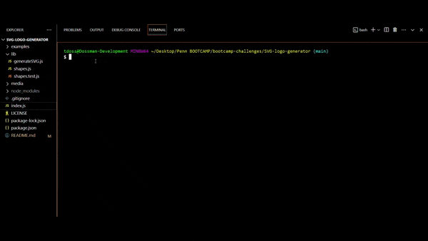
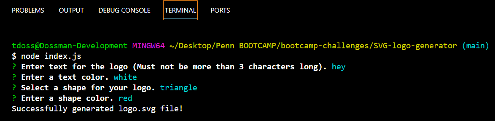
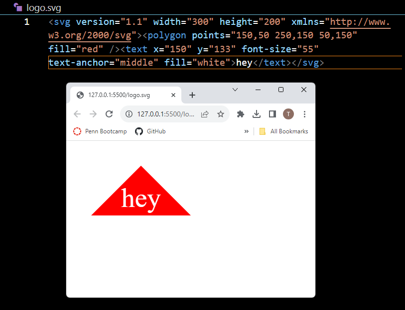
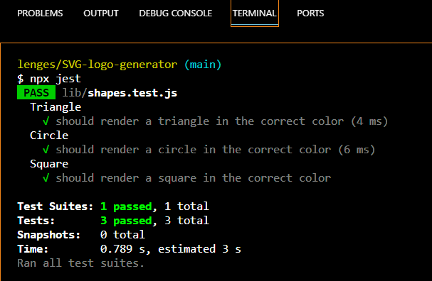

# SVG Logo Generator

## License

This project is licensed under the [MIT License] - see [LICENSE](LICENSE) file for more details.

## Description

A Node.js command-line application that dynamically generates a logo SVG image file based on user responses to a series of prompts.  

## Table of Contents

- [License](#license)
- [Description](#description)
- [Demonstration](#demonstration)
- [Screenshots](#screenshots)
- [Installation](#installation)
- [Usage](#usage)
- [Testing](#testing)
- [Technologies](#technologies)
- [Questions](#questions)

## Demonstration

[Link to Demonstration video](https://clipchamp.com/watch/n8DFtZugx86)

## Screenshots
### Initiate App and Usage

### Newly Created File

### Sample of File

### Testing

## Installation

1. Fork or Clone my repository to your local machine.
2. Install the following: 
- Node.JS [Version 20.10.0 LTS](https://nodejs.org/en)
- Inquirer: [Version 8.2.4](https://www.npmjs.com/package/inquirer/v/8.2.4)
- Jest [Version 29.7.0](https://www.npmjs.com/package/jest)
3. Open the forked or cloned repository in VSCode or your preferred code editor.
4. Open the integrated terminal for the document and install all dependencies using command: `npm install`

## Usage

### Run application:

1. Run the application using command: `node index.js` in the file's integrated terminal.
2. User will be presented with a series of prompts with Inquirer and should answer each according to instructions.
3. Once complete, 'logo.svg' file will be dynamically created using user responses.
4. Open newly created 'logo.svg' file, and feel free to alter, rename, or recreate file to fulfill your needs. 

## Testing

1. Open the integrated terminal in the project directory and run tests suite using the either of the following commands: `npx jest` or `npm run test`
2. test suite will test to make sure that each shape is correctly rendered while also filled with the correct color according to user input.

## Technologies

### Jest [Version 29.7.0](https://www.npmjs.com/package/jest)

### Inquirer [Version 8.2.4](https://www.npmjs.com/package/inquirer/v/8.2.4)

## Questions

[Follow me on Github!](https://github.com/Dossman-thomas)

Have any further questions? Feel free to reach me via tdossman.development@gmail.com

